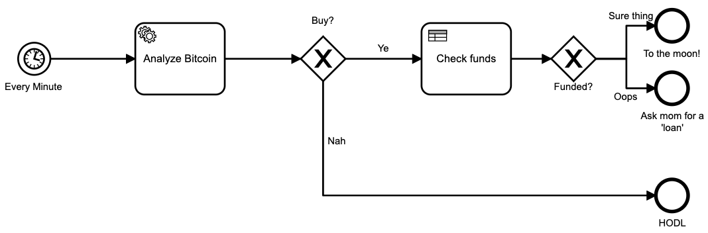
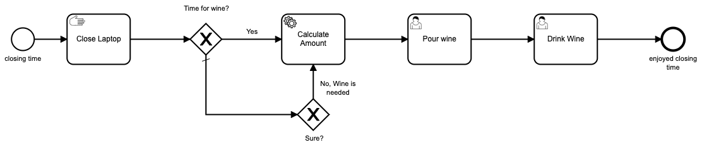
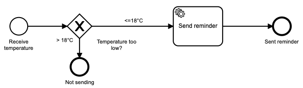
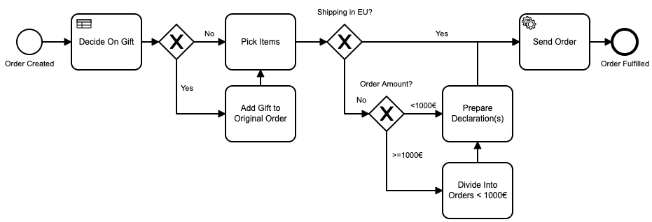
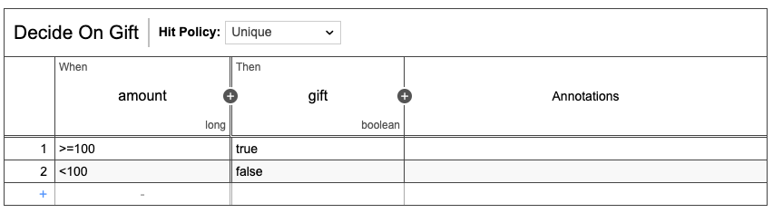

# Demos using the Camunda Platform

One of the projects that students work on as part of the HPI lecture ["Trends and Concepts in the Software Industry I"](https://hpi.de/plattner/teaching/summer-term-2021/trends-and-concepts-in-the-software-industry-i.html) in the summer term 2021 is using process/[workflow engines](https://en.wikipedia.org/wiki/Workflow_engine) to execute core enterprise processes.

The [Camunda Platform](https://camunda.com/products/camunda-platform/) is an [open-source](https://github.com/camunda/camunda-bpm-platform) BPMN workflow engine.
To get to know the technology, the team consisting of [Fabian](https://github.com/fabianhe), [Moritz](https://github.com/manner), [Caterina](https://github.com/caterinamandel98) and [Altanbagana](https://github.com/Altanbagana92) created the following demos:

## 💰 Bitcoin Analysis

In the fast-paced world of cryptocurrency, this demo by Fabian using Python checks the Bitcoin price every minute using an external API by coindesk.com. 
It then executes a bold investment strategy with the following:

```Python
from random import choice
buy = choice((True, False))
```

The check whether we would spend more than we currently can (`Check funds`) is implemented in an activity using a DMN matrix.



## 🍷 Closing Time

After a long day in the home office, it's time to unwind in Caterina's demo. If it's been a tough day and you need a glass of wine, you can enter the required amount into a form with a generous default value. And the activity `drink wine` is also modeled. Cheers!

```HTML
<camunda:formField id="wine_need" label="Wine Need" type="long" defaultValue="5" />
```



## 🌡 Temperature Reminder

Are you someone who forgets to turn on the heating when it's getting cold out? Moritz's demo can send you a reminder message using the Telegram platform if the temperature drops below 18°C. The demo uses the [Telegram API](https://github.com/yagop/node-telegram-bot-api), called from a JavaScript worker.



## 🛒 Order Fulfillment
Altanbagana's demo workflow takes us to the domain of online shopping. The BPMN model includes logic to split large orders going to outside of the EU and a decision matrix for gift selection.




